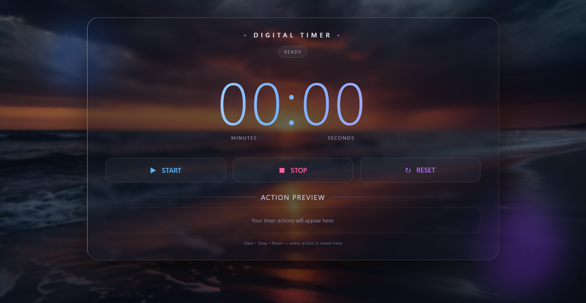

# Digital Timer

A modern, responsive **Digital Timer** built with HTML, CSS, and
JavaScript.\
It provides a clean glassmorphism-style interface with Start, Stop, and
Reset controls and an action preview area.

## Preview



## Features

-   ⏱️ Digital countdown timer display
-   ▶️ Start the timer
-   ⏹️ Stop/pause the timer
-   🔄 Reset the timer
-   📝 Action Preview section for timer actions
-   💎 Modern glassmorphism UI
-   🌌 Background image with blurred overlay effect
-   📱 Responsive layout for different screen sizes
-   ✨ Smooth and attractive visual styling

## Technologies Used

-   **HTML5** --- Page structure
-   **CSS3** --- Styling, glassmorphism, layout, and responsive design
-   **JavaScript** --- Timer functionality and button interactions

## How It Works

The timer displays time in **minutes and seconds**.

-   **Start** begins the countdown.
-   **Stop** pauses the countdown.
-   **Reset** returns the timer to its initial state.
-   Timer actions can be displayed in the **Action Preview** section.

## Project Structure

``` text
digital-timer/
│
├── index.html
├── style.css
├── script.js
└── digital-timer-preview.png
```

> Update the file names above if your project uses different HTML, CSS,
> or JavaScript filenames.

## UI Design

The interface uses a dark, futuristic design with:

-   Glassmorphism cards
-   Rounded borders
-   Soft transparency
-   Blue and purple accent colors
-   Large digital timer typography
-   Background blur and glow effects
-   Minimal and clean controls

## Getting Started

1.  Download or clone the project.
2.  Keep the HTML, CSS, JavaScript, and image files in the correct
    locations.
3.  Open `index.html` in your browser.
4.  Use **Start**, **Stop**, and **Reset** to control the timer.

## Future Improvements

Possible additions include:

-   Custom timer duration input
-   Countdown completion sound
-   Progress indicator
-   Multiple timer presets
-   Local storage for action history
-   Dark/light theme switch
-   Keyboard shortcuts
-   Notification when the timer finishes

## License

This project is free to use for learning and personal projects.
