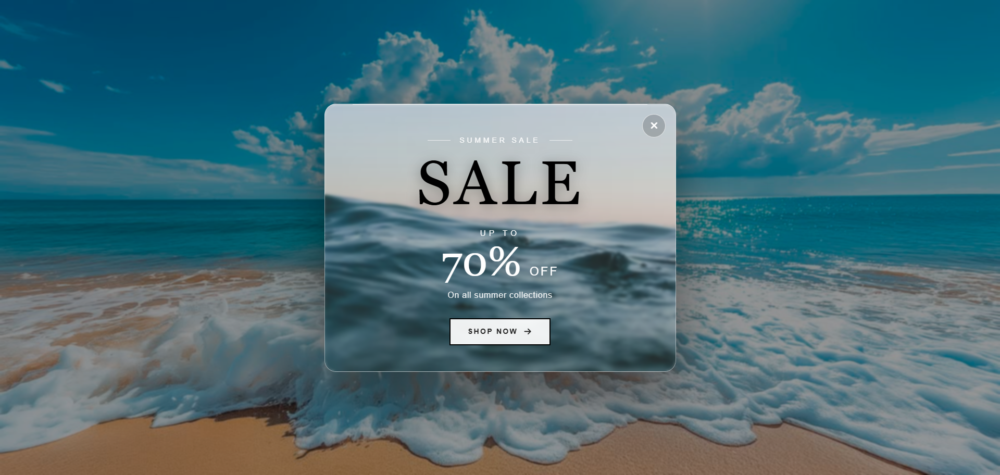

# 🌊 Model 1 – Summer Sale Modal



## 📌 About This Project

This project is a **Summer Sale Popup Modal** created using **HTML, CSS, and JavaScript**.

The main purpose of this project is to learn how JavaScript's **`setTimeout()`** function can be used to display a modal after a specific amount of time.

---

## 🎯 Learning Objective

In this project, you will learn:

* How `setTimeout()` works
* How to delay an action using JavaScript
* How to show and hide a modal
* How to use `classList.add()`
* How to use `classList.remove()`
* How to select elements using the DOM
* How to use `addEventListener()`
* How to create a glassmorphism effect
* How CSS transitions work

---

## ⏱️ What is `setTimeout()`?

`setTimeout()` is a JavaScript function that executes a function **after a specified amount of time**.

### Syntax

```javascript
setTimeout(function () {
    // code to execute
}, delay);
```

The delay is written in **milliseconds**.

| Time      | Milliseconds |
| --------- | -----------: |
| 1 second  |       `1000` |
| 2 seconds |       `2000` |
| 3 seconds |       `3000` |
| 5 seconds |       `5000` |

### Example

```javascript
setTimeout(function () {
    console.log("Hello");
}, 3000);
```

The message will appear after **3 seconds**.

---

## 🪟 Showing the Modal After 3 Seconds

For this project, the modal can be displayed after 3 seconds:

```javascript
const modal = document.getElementById("modal");

setTimeout(function () {
    modal.classList.add("show");
}, 3000);
```

### How it works

```text
Page loads
    ↓
JavaScript starts
    ↓
Wait 3 seconds
    ↓
setTimeout() executes
    ↓
"show" class is added
    ↓
Modal appears
```

---

## ❌ Closing the Modal

The close button can remove the `show` class:

```javascript
closeBtn.addEventListener("click", function () {
    modal.classList.remove("show");
});
```

So:

```text
Click Close
     ↓
Remove "show"
     ↓
Modal disappears
```

---

## 🎨 Design

The modal contains:

* 🌊 Ocean background
* 🪟 Glassmorphism modal
* ❌ Close button
* ☀️ Summer Sale heading
* 💰 Discount percentage
* 🛍️ Shop Now button
* ✨ Smooth animation

---

## 🧊 Glassmorphism Effect

The glass effect can be created using:

```css
.modal {
    background: rgba(255, 255, 255, 0.25);
    backdrop-filter: blur(10px);
    border: 1px solid rgba(255, 255, 255, 0.4);
}
```

The important property is:

```css
backdrop-filter: blur(10px);
```

It creates the blurred glass effect behind the modal.

---

## 🧪 Practice

### 1. Change the popup delay

Try:

```javascript
setTimeout(showModal, 1000);
```

Then try:

```javascript
setTimeout(showModal, 5000);
```

Observe how the popup timing changes.

### 2. Automatically close the modal

```javascript
setTimeout(function () {
    modal.classList.remove("show");
}, 8000);
```

### 3. Try different animations

Create:

* Fade In
* Slide Up
* Slide Down
* Zoom In
* Scale In

---

## 🧠 Important Concept

`setTimeout()` does **not** stop JavaScript for 3 seconds.

It schedules the function to execute later.

Example:

```javascript
console.log("Start");

setTimeout(function () {
    console.log("Modal");
}, 3000);

console.log("End");
```

Output:

```text
Start
End
Modal
```

---

## 🛠️ Technologies Used

* HTML5
* CSS3
* JavaScript
* DOM Manipulation
* `setTimeout()`
* `addEventListener()`
* `classList`
* CSS Transitions
* `backdrop-filter`

---

## 📁 Folder Structure

```text
Model-1/
│
├── index.html
├── style.css
├── script.js
├── README.md
│
└── img/
    └── model-1-preview.png
```

---

## 🚀 How to Run

1. Open the `Model-1` folder.
2. Open `index.html`.
3. Wait 3 seconds.
4. The modal will appear.
5. Click the close button.
6. Change the `setTimeout()` value.
7. Test different delays.

---

## 💡 Challenge

Try adding:

* Countdown before the popup
* Automatic closing
* "Don't show again" button
* Different background images
* Different popup animations
* A second popup

---

## 📚 Main Concept

```text
setTimeout()
     ↓
Wait for delay
     ↓
Execute function
     ↓
Modify DOM
     ↓
Add CSS class
     ↓
Show Modal
```
