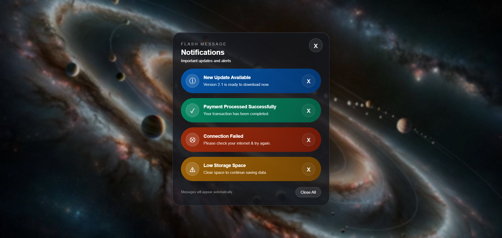

# 🌌 Model 2 – Notification Modal



## 📌 About This Project

This project is a **Notification Modal / Flash Message UI** created using **HTML, CSS, and JavaScript**.

The main purpose is to practice JavaScript's **`setTimeout()`** function while creating a notification interface with multiple types of messages.

---

## 🎯 Learning Objective

In this project, you will learn:

* How `setTimeout()` works
* How to display a modal after a delay
* How to manipulate DOM elements
* How to add and remove CSS classes
* How click events work
* How to close individual notifications
* How to close all notifications
* How to create different notification styles
* How to create dark glassmorphism UI

---

## ⏱️ What is `setTimeout()`?

`setTimeout()` executes a function **after a specified delay**.

### Syntax

```javascript
setTimeout(function () {
    // code to execute
}, delay);
```

For example:

```javascript
setTimeout(function () {
    console.log("Notification displayed!");
}, 3000);
```

The function executes after **3 seconds**.

---

## 🔔 Notification Types

This design contains four different notification types.

### 🔵 Information

```text
New Update Available
Version 2.1 is ready to download now.
```

Used for general information.

### 🟢 Success

```text
Payment Processed Successfully
Your transaction has been completed.
```

Used when an action completes successfully.

### 🔴 Error

```text
Connection Failed
Please check your internet & try again.
```

Used when something goes wrong.

### 🟡 Warning

```text
Low Storage Space
Clear space to continue saving data.
```

Used when the user needs attention.

---

## 🪟 Showing the Notification Modal

The notification panel can appear after 3 seconds:

```javascript
const notificationModal =
    document.getElementById("notificationModal");

setTimeout(function () {
    notificationModal.classList.add("show");
}, 3000);
```

### Flow

```text
Page loads
     ↓
Wait 3 seconds
     ↓
setTimeout()
     ↓
Add "show" class
     ↓
Notification modal appears
```

---

## ❌ Closing Individual Notifications

Each notification can have its own close button.

Example:

```javascript
closeButton.addEventListener("click", function () {
    notification.remove();
});
```

This removes only the selected notification.

---

## 🚫 Close All Button

A **Close All** button can remove every notification:

```javascript
closeAllBtn.addEventListener("click", function () {
    notifications.forEach(function (notification) {
        notification.remove();
    });
});
```

This is useful for learning how JavaScript can work with multiple DOM elements.

---

## 🎨 Design

The notification UI contains:

* 🌌 Galaxy background
* 🪟 Dark glassmorphism panel
* 🔵 Information notification
* 🟢 Success notification
* 🔴 Error notification
* 🟡 Warning notification
* ❌ Individual close buttons
* 🚫 Close All button
* ✨ Smooth transitions

---

## 🧊 Dark Glassmorphism

A dark glass effect can be created using:

```css
.notification-modal {
    background: rgba(20, 20, 25, 0.55);
    backdrop-filter: blur(12px);
    border: 1px solid rgba(255, 255, 255, 0.15);
}
```

The combination of:

* Transparency
* Blur
* Border
* Shadow

creates the glass-like appearance.

---

## 🧪 Practice

### 1. Change the popup delay

Try:

```javascript
setTimeout(showModal, 1000);
```

Then:

```javascript
setTimeout(showModal, 5000);
```

---

### 2. Automatically remove a notification

```javascript
setTimeout(function () {
    notification.remove();
}, 5000);
```

The notification will disappear after 5 seconds.

---

### 3. Show notifications one by one

Try:

```javascript
setTimeout(showNotification1, 1000);

setTimeout(showNotification2, 3000);

setTimeout(showNotification3, 5000);
```

This creates a sequence of notifications.

---

## 🆚 Model 1 vs Model 2

Both projects use:

```javascript
setTimeout()
```

But they use it for different UI purposes.

| Model 1             | Model 2             |
| ------------------- | ------------------- |
| Sale Popup          | Notification System |
| One main message    | Multiple messages   |
| Beach background    | Space background    |
| Shop Now button     | Close controls      |
| Promotional UI      | System UI           |
| Light glassmorphism | Dark glassmorphism  |

---

## 🧠 Important Concept

`setTimeout()` executes a function **once after the specified delay**.

Example:

```javascript
setTimeout(function () {
    console.log("Notification shown");
}, 3000);
```

This runs once after approximately 3 seconds.

This is different from:

```javascript
setInterval(function () {
    console.log("Notification shown");
}, 3000);
```

`setInterval()` repeats the function every 3 seconds.

---

## 🛠️ Technologies Used

* HTML5
* CSS3
* JavaScript
* DOM Manipulation
* `setTimeout()`
* `addEventListener()`
* `classList`
* CSS Transitions
* `backdrop-filter`

---

## 📁 Folder Structure

```text
Model-2/
│
├── index.html
├── style.css
├── script.js
├── README.md
│
└── img/
    └── model-2-preview.png
```

---

## 🚀 How to Run

1. Open the `Model-2` folder.
2. Open `index.html`.
3. Wait 3 seconds.
4. The notification panel appears.
5. Try closing individual notifications.
6. Try the Close All button.
7. Change the `setTimeout()` delay.

---

## 💡 Challenge

Try adding:

* Notification sound
* Notification counter
* Auto-close timer
* Progress bar
* New notification button
* Notification timestamp
* Different notification animations
* Notification stacking
* Reopen notification button

---

## 📚 Main Concept

```text
setTimeout()
      ↓
Wait for delay
      ↓
Execute function
      ↓
Modify DOM
      ↓
Add/remove CSS class
      ↓
Create Notification UI
```
