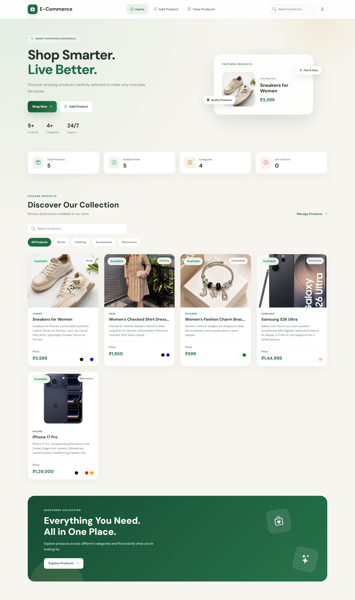
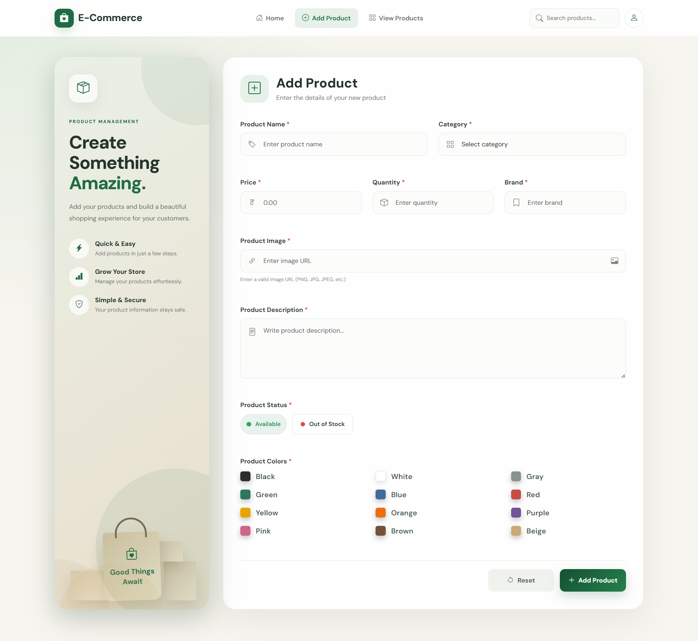
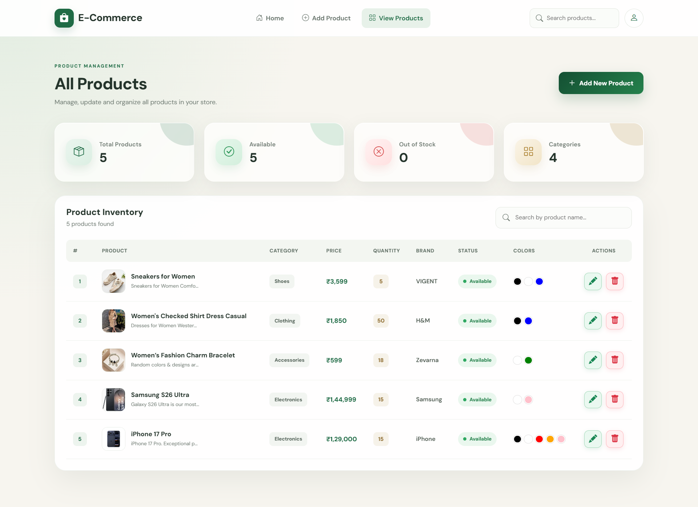
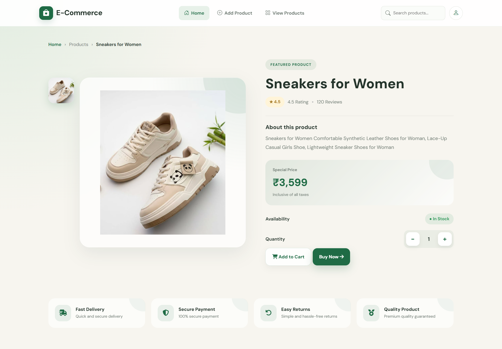

<div align="center">


<br>


<br><br>


<br><br>

> ✨ **Shop Smarter. Manage Better. Experience Premium.**

<br>


</div>

---

# 💎 About The Project

**E-Commerce** is a modern and professional **E-Commerce Product Management Website** created using:

> 🌐 **HTML5** + 🎨 **CSS3** + ⚡ **Vanilla JavaScript**

The application combines a premium shopping experience with product management functionality, allowing users to:

- 🛍️ Browse products
- 🔍 Search products
- 🏷️ Filter products
- ➕ Add products
- ✏️ Edit products
- 🗑️ Delete products
- 📦 Manage inventory
- 🎨 Select product colors
- 🛒 Explore product details

The project focuses on:

<div align="center">

**✨ Premium UI**  
**🎨 Modern Design**  
**🚀 Smooth Animations**  
**📱 Responsive Layout**  
**⚡ Interactive Experience**

</div>

<br>

<div align="center">


</div>

---

# 🖼️ Project Showcase

<div align="center">

## 🏠 Home Page



<br><br>


<br><br>

## ➕ Add Product Page



<br><br>


<br><br>

## 📦 Product Management



<br><br>


<br><br>

## 🛍️ Product Details



</div>

---

# ⚡ Core Features

<div align="center">

| 🏠 Experience | 📦 Management | 🔍 Discovery |
|:---:|:---:|:---:|
| Premium Homepage | Add Products | Product Search |
| Featured Products | Edit Products | Category Filter |
| Responsive UI | Delete Products | Product Details |
| Smooth Animations | Stock Management | Color Selection |

</div>

<br>

<div align="center">


</div>

---

# 🌟 Key Features

## 🏠 Premium Homepage

The homepage provides a modern and engaging shopping experience with:

- ✨ Beautiful hero section
- 🛍️ Featured product showcase
- 📊 Product statistics
- 🔍 Smart product search
- 🏷️ Category filtering
- 🃏 Interactive product cards
- 🎨 Premium collection section
- 🖱️ Smooth hover effects
- 🔘 Interactive buttons
- 🚀 Elegant animations
- 📱 Responsive layout

---

## ➕ Add Product

A professional product management form allows users to add new products easily.

### 📝 Product Information

| Field | Purpose |
|:---|:---|
| 🏷️ Product Name | Product identification |
| 📂 Category | Product classification |
| 💰 Price | Product pricing |
| 📦 Quantity | Inventory amount |
| 🏢 Brand | Product brand |
| 🖼️ Product Image | Product visual |
| 📝 Description | Product information |
| 📊 Product Status | Availability |
| 🎨 Product Colors | Available colors |

### 📦 Product Status

| Status | Description |
|:---:|:---|
| 🟢 **Available** | Product is available for purchase |
| 🔴 **Out of Stock** | Product is currently unavailable |

### 🎨 Product Colors

Supported product colors include:

⚫ Black • ⚪ White • 🩶 Gray • 🟢 Green • 🔵 Blue • 🔴 Red

🟡 Yellow • 🟠 Orange • 🟣 Purple • 🩷 Pink • 🟤 Brown • 🟨 Beige

---

# 📦 Product Management

The Product Inventory section provides complete product management functionality.

### ⚡ Features

- 🔍 Search products
- ✏️ Edit products
- 🗑️ Delete products
- 📦 Manage product quantity
- 🟢 Track available products
- 🔴 Track out-of-stock products
- 🎨 View product colors
- 🏷️ View product categories
- 📊 View product statistics
- 🔄 Dynamically update product information

### 📊 Inventory Overview

<div align="center">

| 📦 Total Products | 🟢 Available | 🔴 Out of Stock | 🏷️ Categories |
|:---:|:---:|:---:|:---:|
| Dynamic | Dynamic | Dynamic | Dynamic |

</div>

---

# 🛍️ Product Details

Each product has a dedicated product details page with a premium shopping experience.

### 🌟 Includes

- 🖼️ Large product image
- 🏷️ Product name
- 📝 Product description
- ⭐ Product rating
- 💬 Customer reviews
- 💰 Special product price
- 🟢 Availability status
- ➖ Quantity controls
- 🛒 Add to Cart button
- ⚡ Buy Now button

---

<div align="center">


</div>

# ✨ Premium Animation Experience

A major focus of this project is creating a **smooth, polished, interactive, and premium user experience**.

---

## 🎭 Page Load Animations

Different sections can smoothly appear when the page loads.

```text
                         ✨ PAGE LOAD
                              │
                              ▼
                       ┌─────────────┐
                       │   FADE IN   │
                       └──────┬──────┘
                              │
                              ▼
                       ┌─────────────┐
                       │  SLIDE UP   │
                       └──────┬──────┘
                              │
                              ▼
                       ┌─────────────┐
                       │   SCALE IN   │
                       └──────┬──────┘
                              │
                              ▼
                       ┌─────────────┐
                       │    REVEAL   │
                       └─────────────┘
```

### Animation Effects

- ✨ Fade-in animations
- ⬆️ Slide-up animations
- ➡️ Slide-in animations
- 🔍 Scale-in animations
- 🌟 Staggered content animations
- 🔄 Smooth section reveals
- 🚀 Elegant transitions

---

## 🃏 Product Card Animations

Product cards include attractive and interactive effects.

```text
              ┌─────────────────────┐
              │   🃏 PRODUCT CARD   │
              └──────────┬──────────┘
                         │
                         ▼
                    🖱️ HOVER
                         │
                         ▼
                  🔍 IMAGE ZOOM
                         │
                         ▼
                    ⬆️ CARD LIFT
                         │
                         ▼
                  🌫️ SOFT SHADOW
                         │
                         ▼
                   ✨ PREMIUM UI
```

### Card Effects

- Smooth hover effects
- Product image zoom
- Card elevation
- Soft shadows
- Border transitions
- Transform animations
- Interactive feedback

---

## 🔘 Button Animations

Buttons provide smooth and responsive interactions.

```text
                     NORMAL
                        │
                        ▼
                    🖱️ HOVER
                        │
                        ▼
                 ⬆️ LIFT + SCALE
                        │
                        ▼
                  🌫️ SHADOW
                        │
                        ▼
                    👆 ACTIVE
                        │
                        ▼
               ⚡ CLICK FEEDBACK
```

### Button Effects

- ✨ Hover transitions
- 🔍 Scale effects
- 🌈 Background transitions
- 🌫️ Shadow effects
- 👆 Click feedback
- ➡️ Icon movement
- ⚡ Active states

---

## 📊 Statistics Animations

Statistics cards can provide a dynamic visual experience.

### Statistics

- 📦 Total Products
- 🟢 Available Products
- 🔴 Out of Stock
- 🏷️ Categories

### Effects

- 🔢 Number counting
- ✨ Fade In
- ⬆️ Slide Up
- 🖱️ Hover elevation
- 🔄 Icon transitions

---

## 🖱️ Interactive Hover Effects

Premium hover interactions are used throughout the website.

| Element | Interaction |
|:---|:---|
| 🔗 Navigation | Smooth highlight |
| 🃏 Product Cards | Lift + zoom + shadow |
| 🔘 Buttons | Scale + shadow |
| 🏷️ Categories | Highlight transition |
| ✏️ Action Icons | Smooth transform |
| 🔍 Search | Focus animation |
| 🎨 Colors | Selection animation |
| 📊 Statistics | Hover elevation |

---

# 🎬 Animation Flow

<div align="center">

```text
✨ ENTER
   ↓
🎭 REVEAL
   ↓
🖱️ INTERACT
   ↓
🔍 TRANSFORM
   ↓
⚡ RESPOND
   ↓
💎 PREMIUM EXPERIENCE
```

</div>

---

<div align="center">


</div>

---

# 🎨 Premium Design System

The project follows a clean, modern, and elegant visual language.

<div align="center">

| Design Element | Style |
|:---|:---|
| 🌿 Color Palette | Soft Green + Deep Green |
| 💎 Visual Style | Premium & Minimal |
| 🃏 Cards | Elegant & Rounded |
| 🌫️ Shadows | Soft & Modern |
| 🔄 Transitions | Smooth |
| 📐 Layout | Clean & Balanced |
| ✍️ Typography | Professional |
| 🖱️ Interaction | Animated |
| 📱 Responsive | Fully Responsive |

</div>

### 🎨 Theme

The interface uses a soft green visual identity to create a clean and premium shopping atmosphere.

```text
Deep Green
     │
     ▼
#10261D
     │
     ▼
Dark Green
     │
     ▼
#2E6B50
     │
     ▼
Premium Green
     │
     ▼
#4A8F68
```

---

# 🛠️ Technologies Used

<div align="center">

| Technology | Purpose |
|:---|:---|
| 🌐 **HTML5** | Website structure & semantic elements |
| 🎨 **CSS3** | Styling, responsive layouts & animations |
| ⚡ **JavaScript** | Dynamic functionality & interactions |

</div>

<br>

### 🌐 HTML5

Used for:

- Semantic structure
- Forms
- Navigation
- Product sections
- Tables
- Product cards

### 🎨 CSS3

Used for:

- Premium UI
- Layout
- Responsive design
- Animations
- Transitions
- Hover effects
- Shadows
- Cards

### ⚡ JavaScript

Used for:

- Product management
- DOM manipulation
- Search
- Filtering
- Dynamic rendering
- Quantity controls
- Product interactions

---

# 💻 JavaScript Features

JavaScript powers the dynamic behavior of the application.

```text
             ➕ ADD PRODUCTS
                    │
                    ▼
             ✏️ EDIT PRODUCTS
                    │
                    ▼
             🗑️ DELETE PRODUCTS
                    │
                    ▼
             🔍 SEARCH PRODUCTS
                    │
                    ▼
             🏷️ FILTER PRODUCTS
                    │
                    ▼
             📊 UPDATE STATS
                    │
                    ▼
             ➖➕ QUANTITY
                    │
                    ▼
             🎨 COLOR SELECT
                    │
                    ▼
             🔄 DYNAMIC RENDER
                    │
                    ▼
             🖱️ UI INTERACTION
```

---

# 🔄 Application Workflow

<div align="center">

```text
🏠 HOME
│
┌────────┼────────┐
▼        ▼        ▼
🔍       🏷️       🛍️
SEARCH    FILTER    DETAILS
│                 │
└────────┬────────┘
▼
📦 PRODUCTS
│
┌─────┼─────┐
▼     ▼     ▼
✏️    🗑️    👀
EDIT  DELETE  VIEW
│
▼
➕ ADD PRODUCT
```

</div>

---

# 📂 Project Structure

```text
E-Commerce/
│
├── 📄 index.html
├── 📄 add-product.html
├── 📄 products.html
├── 📄 product-details.html
├── 📄 edit-product.html
│
├── 📁 css/
│   ├── 📄 style.css
│   └── 📄 media.css
│
├── 📁 js/
│   ├── 📄 script.js
│   ├── 📄 add-product.js
│   ├── 📄 view-products.js
│   ├── 📄 edit-products.js
│   └── 📄 product-details.js
│
├── 📁 images/
│   ├── 🖼️ home.png
│   ├── 🖼️ add-product.png
│   ├── 🖼️ view-product.png
│   ├── 🖼️ product-details.png
│   │
│   ├── 📁 products/
│   └── 📁 ui/
│
└── 📄 README.md
```

---

# 🎯 Main Pages

## 🏠 Home

The homepage includes:

- Hero section
- Featured product
- Product statistics
- Product categories
- Product search
- Category filters
- Product collection
- Featured collection banner

---

## ➕ Add Product

A professional product creation page where users can add complete product information.

### Includes

- Product details
- Category selection
- Price
- Quantity
- Brand
- Product image
- Description
- Product status
- Product colors

---

## 📦 View Products

A complete product inventory management page.

Users can:

- 🔍 Search products
- 👀 View product information
- ✏️ Edit products
- 🗑️ Delete products
- 📦 Check quantity
- 🟢 Check stock status
- 🎨 View product colors
- 🏷️ View categories
- 📊 View inventory statistics

---

## 🛍️ Product Details

A premium product details page featuring:

- 🖼️ Large product image
- 🏷️ Product name
- ⭐ Rating
- 💬 Reviews
- 📝 Description
- 💰 Product price
- 🟢 Stock status
- ➖➕ Quantity selector
- 🛒 Add to Cart
- ⚡ Buy Now

---

# 📱 Responsive Design

The website is designed to provide a consistent experience across different screen sizes.

<div align="center">

| Device | Support |
|:---|:---:|
| 💻 Desktop | ✅ Fully Optimized |
| 💼 Laptop | ✅ Fully Optimized |
| 📲 Tablet | ✅ Responsive |
| 📱 Mobile | ✅ Responsive |

</div>

Responsive styling is handled through:

```text
css/media.css
```

---

# 🚀 Getting Started

## 1️⃣ Clone The Repository

```bash
git clone https://github.com/your-username/e-commerce.git
```

## 2️⃣ Open The Project Folder

```bash
cd e-commerce
```

## 3️⃣ Run The Project

Open:

```text
index.html
```

Or use the **Live Server** extension in Visual Studio Code.

---

# 💡 Animation Implementation

### ✨ Entrance Animation

```css
@keyframes fadeUp {
    from {
        opacity: 0;
        transform: translateY(30px);
    }

    to {
        opacity: 1;
        transform: translateY(0);
    }
}
```

### 🃏 Product Card Hover

```css
.product-card {
    transition:
        transform 0.4s ease,
        box-shadow 0.4s ease;
}

.product-card:hover {
    transform: translateY(-10px);
}
```

### 🔘 Button Interaction

```css
button {
    transition:
        transform 0.3s ease,
        box-shadow 0.3s ease;
}

button:hover {
    transform: translateY(-2px) scale(1.02);
}

button:active {
    transform: scale(0.97);
}
```

---

# 🏆 Project Highlights

<div align="center">

| Feature | Status |
|:---|:---:|
| 🏠 Premium Homepage | ✅ |
| ➕ Add Product | ✅ |
| 📦 Product Management | ✅ |
| 🔍 Product Search | ✅ |
| 🏷️ Category Filtering | ✅ |
| ✏️ Edit Products | ✅ |
| 🗑️ Delete Products | ✅ |
| 🛍️ Product Details | ✅ |
| 🎨 Color Selection | ✅ |
| ✨ Smooth Animations | ✅ |
| 🖱️ Interactive Hover Effects | ✅ |
| 📱 Responsive Design | ✅ |
| 💎 Premium UI | ✅ |

</div>

---

# 💎 Why This Project?

This project demonstrates practical frontend development skills through a complete and interactive E-Commerce interface.

### Skills Demonstrated

- 🌐 HTML5
- 🎨 CSS3
- ⚡ Vanilla JavaScript
- 📱 Responsive Web Design
- 🎯 Modern UI/UX
- ✨ CSS Animations
- 🔄 CSS Transitions
- 🖱️ DOM Manipulation
- 🔍 Search & Filtering
- 📦 Product Management
- 🧩 Dynamic Components
- 📐 Professional Layout Design

---

# 🔮 Future Improvements

The project can be extended with:

- 🛒 Shopping Cart
- ❤️ Wishlist
- 👤 User Authentication
- 🔐 Admin Dashboard
- 💳 Payment Gateway
- 📦 Order Management
- ⭐ Product Reviews
- 🌙 Dark Mode
- 🔔 Notifications
- ☁️ Database Integration
- 🔥 Backend Integration
- 📊 Advanced Analytics
- 🎞️ Advanced Page Transitions
- 📧 Email Notifications
- 📱 Progressive Web App Support

---

# 🗺️ Future Roadmap

```text
✅ Frontend UI
      │
      ▼
✅ Product Management
      │
      ▼
✅ Search & Filtering
      │
      ▼
✅ Responsive Design
      │
      ▼
✅ Premium Animations
      │
      ▼
🔜 Shopping Cart
      │
      ▼
🔜 Authentication
      │
      ▼
🔜 Backend Integration
      │
      ▼
🔜 Database
      │
      ▼
🔜 Payment Gateway
```

---

# ⭐ Show Your Support

<div align="center">

If you like this project, consider giving it a **⭐ Star** on GitHub.

It helps motivate me to build more creative and modern projects. 🚀

<br>


</div>

---

# 👩‍💻 Author

<div align="center">

## Built With ❤️

### HTML • CSS • JavaScript

<br>


</div>

<br>

<div align="center">


<br><br>

# 🛍️ Shop Smarter. Live Better. ✨

### Made with HTML, CSS & JavaScript 💻🚀

<br>


</div>