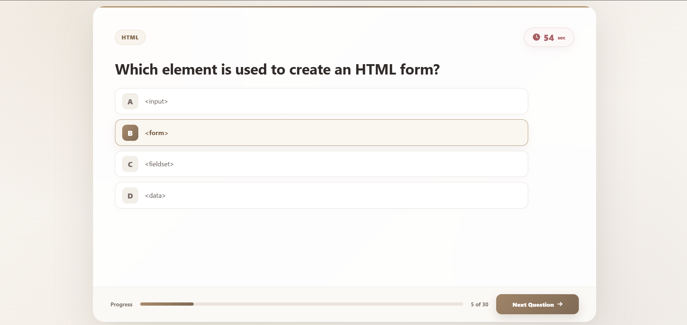

# 🧠 QuizApp

<p align="center">
  
</p>

<p align="center">
  
</p>

<p align="center">
  <i>An elegant and interactive quiz application built using HTML, CSS & JavaScript.</i>
</p>

<br>

<p align="center">
  
  
  
</p>

<br>

<p align="center">
  <b>📝 Multiple Questions</b>
  &nbsp;&nbsp;&nbsp;•&nbsp;&nbsp;&nbsp;
  <b>⏱️ Timer Per Question</b>
  &nbsp;&nbsp;&nbsp;•&nbsp;&nbsp;&nbsp;
  <b>🏆 Instant Results</b>
</p>

<p align="center">
  
</p>

# ✨ About QuizSphere

**QuizSphere** is a modern and interactive quiz application built using **HTML, CSS, and JavaScript**.

The application allows users to answer multiple-choice questions while managing their time for each question.

Users can select an answer and manually move to the next question. If the time for a question finishes, the application automatically moves to the next question.

After completing the quiz, users can submit their answers and instantly view their final performance.

### 🎯 The quiz includes:

- 📝 Multiple-choice questions
- ⏱️ Countdown timer for every question
- ➡️ Next question navigation
- 🔄 Automatic question change when time finishes
- 📊 Quiz progress tracking
- ⚠️ Submit confirmation popup
- 🏆 Final result calculation

<p align="center">
  
</p>

# 🚀 Features

| Feature | Description |
|---|---|
| 📝 Multiple Questions | Users can answer multiple-choice questions |
| 🔤 Four Options | Every question contains multiple answer options |
| ⏱️ Question Timer | Each question has its own countdown timer |
| ⚙️ Custom Time | Time per question can be changed easily |
| ➡️ Next Question | Move manually to the next question |
| 🔄 Auto Next | Automatically moves forward when time reaches 0 |
| 📊 Progress Bar | Shows the user's quiz progress |
| 🔢 Question Counter | Displays the current question number |
| ⚠️ Submit Confirmation | Asks for confirmation before submitting |
| 🏆 Final Result | Displays the user's complete quiz performance |
| ✅ Correct Answers | Shows the total number of correct answers |
| ❌ Wrong Answers | Shows the total number of incorrect answers |
| ⏭️ Skipped Questions | Shows unanswered questions |

<p align="center">
  
</p>

# 📸 Screenshots

### 📝 Quiz Question Page

<p align="center">
  
</p>

The main quiz interface contains:

- 🏷️ Quiz category
- ❓ Current question
- 🔤 Multiple answer options
- ⏱️ Countdown timer
- 📊 Quiz progress bar
- 🔢 Question counter
- ➡️ Next Question button

The user can select an answer and continue to the next question.

<p align="center">
  
</p>

Every question has a countdown timer.

The timer helps users complete the quiz within the allowed time.

For example:

```text
60 Seconds
     ↓
45 Seconds
     ↓
30 Seconds
     ↓
15 Seconds
     ↓
0 Seconds
```

⚠️ Submit Confirmation
<p align="center">  </p>

Before submitting the quiz, the application displays a confirmation popup.

The user is asked:

Are you sure you want to submit?

The popup also informs the user that answers cannot be changed after submission.

Available Options:

⬅️ No, Continue

Continue answering the quiz.

🚀 Yes, Submit

Submit the quiz and calculate the final result.

This prevents users from accidentally submitting the quiz.


### 🏆 Quiz Result
<p align="center">  </p>

After submitting the quiz, the application automatically calculates the user's performance.

<p align="center">
  
</p>

### 🎯 What I Learned

While building this project, I practiced:

HTML page structure
CSS layouts
Responsive design
JavaScript DOM manipulation
Event listeners
Arrays and objects
Conditional statements
Functions
setInterval()
Countdown timers
Dynamic question rendering
User interaction
Score calculation
Progress tracking
Modal functionality

<p align="center">
  
</p>

# 👩‍💻 Author
<p align="center">  </p> <p align="center"> Made with ❤️ using <b>HTML, CSS & JavaScript</b> </p> <p align="center"> ⭐ If you like this project, don't forget to give it a star! </p> <p align="center">  </p> `