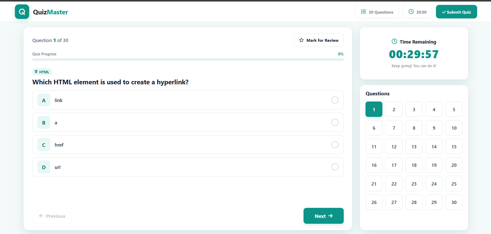
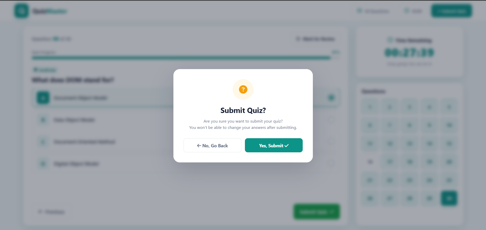
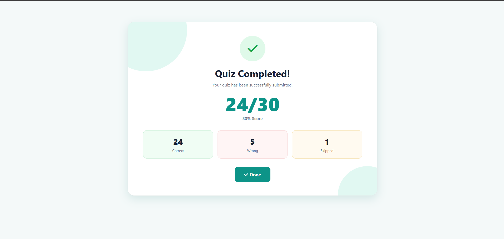

# 🎯 QuizMaster

<p align="center">
  
</p>

<p align="center">
  
</p>

<p align="center">
  <i>A simple and interactive quiz application built with HTML, CSS & JavaScript.</i>
</p>

<br>

<p align="center">
  
  
  
</p>

<br>

<p align="center">
  <b>📝 30 Questions</b>
  &nbsp;&nbsp;&nbsp;•&nbsp;&nbsp;&nbsp;
  <b>⏱️ 30 Minutes</b>
  &nbsp;&nbsp;&nbsp;•&nbsp;&nbsp;&nbsp;
  <b>🎯 Beginner</b>
</p>

<p align="center">
  
</p>

## ✨ About QuizMaster

**QuizMaster** is a simple and interactive quiz application created using **HTML, CSS, and JavaScript**.

The application contains multiple-choice questions based on:

- 🌐 HTML
- 🎨 CSS
- ⚡ JavaScript

Users can select answers, move between questions, mark questions for review, and submit the quiz to see their final result.

<p align="center">
  
</p>

## 🚀 Features

| Feature | Description |
|---|---|
| 📝 30 Questions | Contains 30 multiple-choice questions |
| 🌐 HTML | Questions related to HTML |
| 🎨 CSS | Questions related to CSS |
| ⚡ JavaScript | Questions related to JavaScript |
| ⏱️ Timer | 30-minute countdown timer |
| 📊 Progress Bar | Shows quiz progress |
| 🔢 Question Navigation | Quickly move to any question |
| ⭐ Mark for Review | Mark questions for later |
| ⬅️ Previous | Go to the previous question |
| ➡️ Next | Move to the next question |
| 📌 Submit Popup | Confirmation before submission |
| 🏆 Result | Shows final quiz result |

<p align="center">
  
</p>

## 📸 Screenshots

### 📝 Quiz Page

<p align="center">
  
</p>

The main quiz page contains:

- Current question
- Four answer options
- Quiz progress
- Timer
- Question navigation
- Mark for Review button
- Previous and Next buttons

<p align="center">
  
</p>

### ⚠️ Submit Confirmation

<p align="center">
  
</p>

Before submitting the quiz, a confirmation popup appears.

The user can:

**No, Go Back** → Continue the quiz

**Yes, Submit** → Submit the quiz and calculate the result

<p align="center">
  
</p>

### 🏆 Quiz Result

<p align="center">
  
</p>

After submitting the quiz, the result page displays:

- 🎯 Final score
- 📊 Percentage
- ✅ Correct answers
- ❌ Wrong answers
- ⏭️ Skipped questions

<p align="center">
  
</p>

## ✨ Animations & Effects

The QuizMaster application includes simple animations and interactive effects to make the interface more attractive.

### 🖱️ Button Effects

Buttons have hover effects when the mouse moves over them.

Examples:

- Submit Quiz
- Next
- Previous
- Mark for Review
- Question numbers

### ⭐ Review Effect

When a question is marked for review, its question number changes its appearance.

The star icon also changes.

### 📊 Progress Animation

The progress bar changes as questions are answered.

```text
0%
 ↓
10%
 ↓
20%
 ↓
30%
 ↓
...
 ↓
100%
```

<p align="center">  </p>

## ⏱️ Timer Effect

The timer continuously counts down during the quiz.

When the remaining time becomes low, the timer changes its appearance to warn the user.

<p align="center">  </p>

## 🛠️ Technologies Used

# HTML5

Used for:

- Creating the structure of the quiz application.

# CSS3

Used for:

- Layout
- Colors
- Buttons
- Cards
- Responsive design
- Animations
- Hover effects

# JavaScript

Used for:

- Loading questions
- Selecting answers
- Question navigation
- Timer
- Progress calculation
- Mark for Review
- Result calculation
- Submit popup

<p align="center">  </p>

## 📂 Project Structure
```
QuizMaster/
│
├── index.html
├── style.css
├── script.js
│
└── image/
    ├── quiz-page.png
    ├── submit-modal.png
    └── quiz-result.png
```

<p align="center">  </p>

## 🚀 Getting Started
1. Clone the project
```
git clone https://github.com/Drash011/JavaScript/tree/main/Quiz%20App
```
1. Open the project
- Open the project folder in VS Code.
1. Run the project
- Open index.html using Live Server.
1. Start the Quiz
- Select an answer and start testing your knowledge! 🧠


<p align="center">  </p>

## 👨‍💻 Author
<p align="center">
  
</p>

<p align="center"> Made with ❤️ using HTML, CSS & JavaScript </p> 

<p align="center">  </p> 
