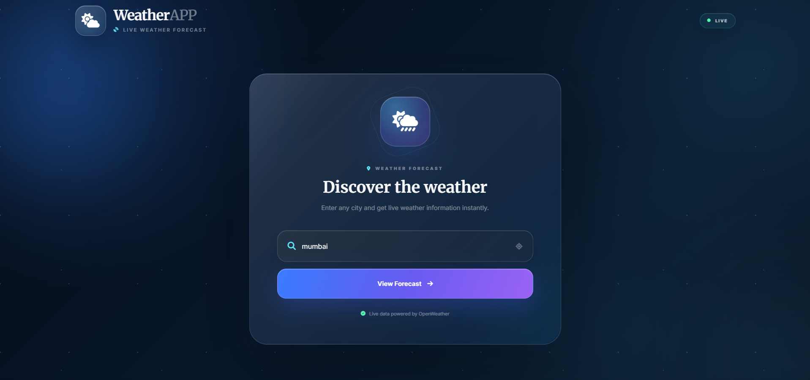
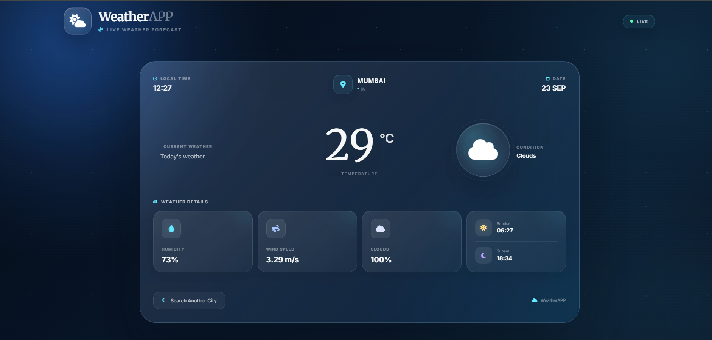

<div align="center">


<br>

<h3>🌤️ A Premium Live Weather Experience</h3>

<p>
A modern weather application built with HTML, CSS and JavaScript,
<br>
powered by the OpenWeather API and designed with a premium glassmorphism interface.
</p>

<br>


<br><br>


<br><br>

</div>

---

<div align="center">

# 🌦️ WeatherAPP

### Discover the Weather. Anywhere. Anytime.

</div>

---

## 🌍 Overview

**WeatherAPP** is a modern and responsive weather application created with **HTML5, CSS3 and JavaScript**.

The application connects with the **OpenWeather API** to retrieve live weather information and presents it through a premium dark-themed dashboard.

Instead of using a basic weather-card layout, the project focuses on creating a more polished real-world interface using:

- 🌌 Atmospheric dark background
- 💎 Glassmorphism panels
- ✨ Soft glowing effects
- 🎨 Blue and cyan accent colors
- 🌤️ Dynamic weather icons
- 📱 Responsive layouts
- ⚡ Smooth UI transitions
- 🕐 Location-based time
- 🌅 Sunrise and sunset information

The main goal is to make weather information **simple to understand while maintaining a premium visual experience**.

---

## 💎 What Makes WeatherAPP Special?

<div align="center">

| 🌍 Real Data | 💎 Premium UI | ⚡ Simple JS |
|:---:|:---:|:---:|
| OpenWeather API | Glassmorphism | Vanilla JavaScript |
| Live Weather | Dark Atmosphere | Fetch API |
| Global Search | Glow Effects | DOM Manipulation |

</div>

The project combines functionality and visual design instead of treating the application as only an API demonstration.

---

## 🔄 How WeatherAPP Works

```text
                                🌤️ WEATHERAPP
                                        │
                                        ▼
                             ┌─────────────────────┐
                             │     ENTER CITY      │
                             └──────────┬──────────┘
                                        │
                                        ▼
                             ┌─────────────────────┐
                             │   SEARCH LOCATION   │
                             └──────────┬──────────┘
                                        │
                                        ▼
                             ┌─────────────────────┐
                             │  OPENWEATHER API    │
                             └──────────┬──────────┘
                                        │
                                        ▼
                             ┌─────────────────────┐
                             │   RECEIVE DATA      │
                             └──────────┬──────────┘
                                        │
                                        ▼
                             ┌─────────────────────┐
                             │PROCESS WEATHER DATA │
                             └──────────┬──────────┘
                                        │
                                        ▼
                    ┌─────────────────────────────────────┐
                    │         PREMIUM DASHBOARD           │
                    │                                     │
                    │  🌡️ Temperature                     │
                    │  ☁️ Weather Condition               │
                    │  💧 Humidity                        │
                    │  💨 Wind Speed                      │
                    │  ☁️ Cloud Coverage                  │
                    │  🌅 Sunrise                         │
                    │  🌙 Sunset                          │
                    │  🕐 Local Time                      │
                    └─────────────────────────────────────┘
```
---

## 🚀 Features
### 🌍 Global City Search

- Users can enter a city name and retrieve its current weather information.

### 🌡️ Live Temperature

- The current temperature is displayed prominently in Celsius.

### ☁️ Dynamic Weather Condition

- The application detects the weather condition returned by the API and displays an appropriate icon.

### 💧 Humidity

- Displays the current humidity percentage.

### 💨 Wind Speed

- Displays the current wind speed in meters per second.

### ☁️ Cloud Coverage

- Displays the current cloud coverage percentage.

### 🌅 Sunrise

- Displays the local sunrise time for the selected location.

### 🌙 Sunset

- Displays the local sunset time for the selected location.

### 🕐 Local Time

- The application calculates the selected location's local time using the timezone information returned by the API.

### 📅 Current Date

- Displays the current local weather date.

### 📱 Responsive Design

- The interface is designed to work across:
- Desktop
- Laptop
- Tablet
- Mobile
---


## 📸 Preview
<div align="center">
🔎 Search Interface


<br><br>

🌤️ Weather Dashboard
 </div>

--- 

## 🧩 Technology

<table>
    <tr>
        <th>Technology</th>
        <th>Purpose</th>
    </tr>
    <tr>
        <td>🧱 <strong>HTML5</strong></td>
        <td>Page structure and semantic content</td>
    </tr>
    <tr>
        <td>🎨 <strong>CSS3</strong></td>
        <td>Premium styling, responsive layouts, glassmorphism and animations</td>
    </tr>
    <tr>
        <td>⚡ <strong>JavaScript</strong></td>
        <td>Application logic, DOM manipulation and API integration</td>
    </tr>
    <tr>
        <td>🌐 <strong>OpenWeather API</strong></td>
        <td>Live weather and location information</td>
    </tr>
    <tr>
        <td>⭐ <strong>Font Awesome</strong></td>
        <td>Weather and interface icons</td>
    </tr>
    <tr>
        <td>🔤 <strong>Google Fonts</strong></td>
        <td>Modern typography and visual hierarchy</td>
    </tr>
</table>

<br>

<div align="center">

### 🛠️ Built With


</div>


---
## 📂 Project Structure
```
WeatherAPP/
│
├── index.html
│
├── css/
│   ├── style.css
│   └── media.css
│
├── js/
│   └── weather.js
│
├── screenshots/
│   ├── search.png
│   └── preview.png
│
└── README.md
```

---
## 👨‍💻 Author
<div align="center">
🌤️ WeatherAPP
Live Weather Forecast Dashboard

Built with:

HTML5 • CSS3 • JavaScript • OpenWeather API

<br>  </div>

<div align="center">


</div>
